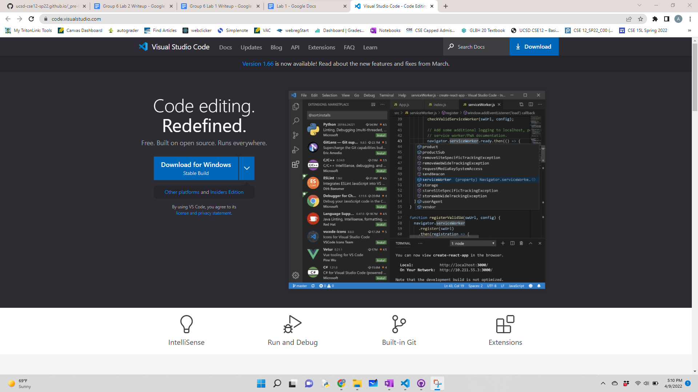
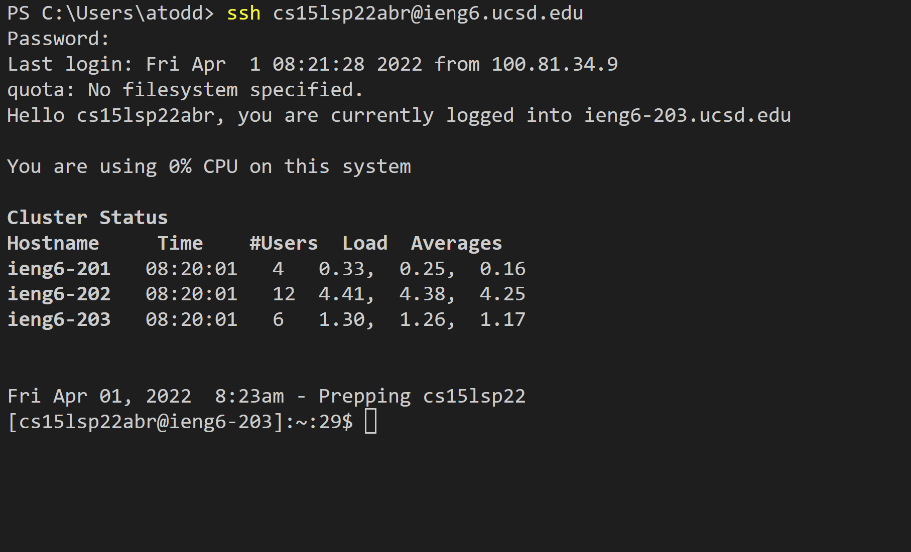

# CSE 15L Remote Running

## Installing VS Code
To install Visual Studio Code, go to https://code.visualstudio.com/. This will take you to the website below.

Just download on the correct operating system by clicking the blue button titled "Download for Windows," finding the right operating system using the arrow to the right of the button, or using the button at the top right labeled "Download." Once downloaded, you should be able to open VS code so that it looks like the window below.

## Remotely Connecting
To remotely connect using Secure Socket Shell, use ssh with your username and the server name. In this class, the command is ssh cs15lDDDDXXX@ieng6.ucsd.edu where DDDD is the quarter of the course (e.g. sp22) and XXX is your unique code. If it is your first time, say yes to the message, then put in your password.

## Trying Some Commands

As shown above, there are lots of Unix commands, and using them changes or shows what is on the server. Some fun and useful commands are cd, which changes the directory, mkdir, which makes a new directory, cp, which copies the contents from one file to another, ls (-a/-lat), which list files in the working directory, pwd, which prints the working directory, rm, which removes files, touch, which creates new files, and cat, which shows the contents of a file.
## Moving Files with scp
Secure copy allows you to transfer files from your local computer to the server. To do so, start in the directory with the file. Then, type scp fileName cs15lDDDDXXX@ieng6.ucsd.edu:~/, where DDDD and XXX are as explained in Remotely Connecting and fileName is the name of the file you want to copy to the server. It should indicate that the file is downloaded and show up on the server, as shown below.

## Setting an SSH Key
Using an SSH key allows you to log in using public and private keys rather than a password. Use the command ssh-keygen ( or ssh-keygen -t ed25519 on Windows) and press enter when prompted for a password. Remotely log in, use the command mkdir .ssh, and on the client type scp /Users/your_username/.ssh/id_rsa.pub cs15lDDDDXXX@ieng6.ucsd.edu:~/.ssh/authorized_keys (where your_username is the username you have on your computer and DDDDXXX is explained in Remotely Connecting) to copy the public key to the server.

Once you've set it up, logging onto the remote server should look like this:

## Optimizing Remote Running
Copying a file to the server and running it is super easy if you know that commands can be written in quotes after the remote login command (doing this will run the commands on the server and log you out) and different commands can be on the same line using semicolons. Simply copy the file over using scp, use the ssh command, but before hitting enter, type in quotes the javac and java commands to run the file, as below:

After you've typed in the commands, you can just cycle through them with the up arrow and select the correct one rather than typing.

