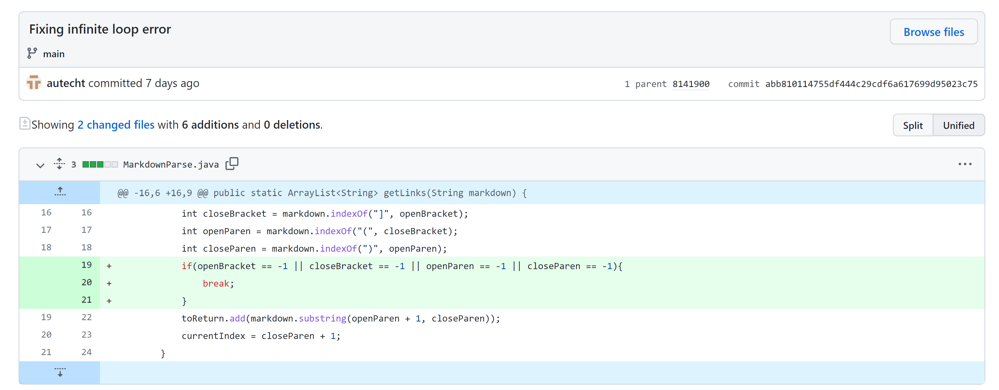
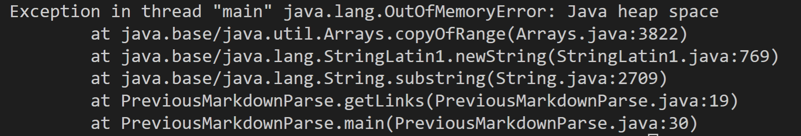
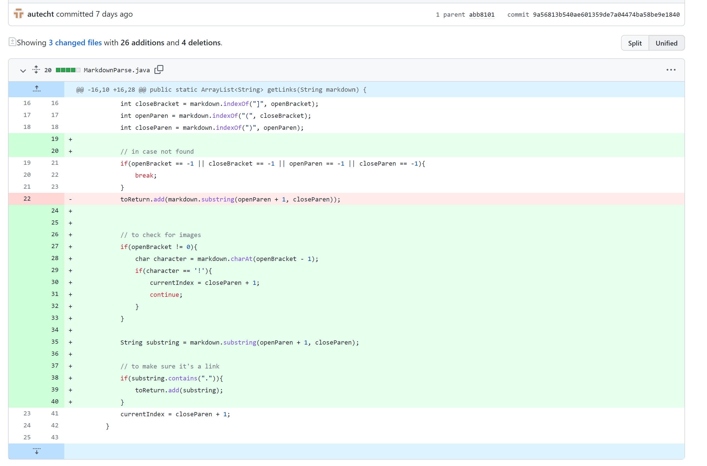
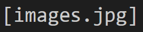
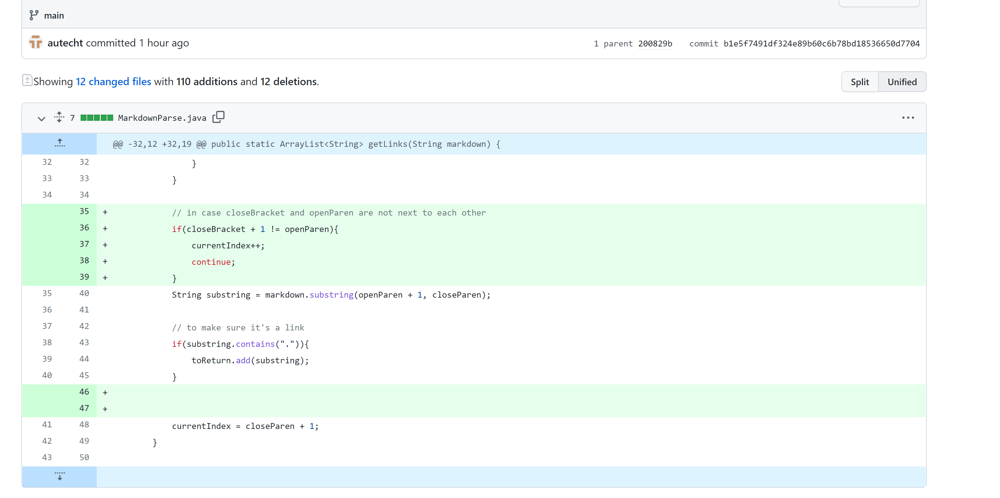

# Lab Report 2
## First Change

We made these changes in response to [this failure inducing input](https://github.com/autecht/markdown-parser/blob/main/my-test-file2.md). That input led to this symptom:



Here, the bug was that the program always updated ```currentIndex``` to ```closeParen + 1```. The failure-inducing input had symbols after the last closing parenthesis, so the while loop ran again after the last link, and ```currentIndex``` would be assigned as 0 because ```closeParen``` was assigned as -1 when another closing parenthesis was not found. This resulted in the symptom of an infinite loop.
## Second Change

We made these changes in response to [this failure inducing input](https://github.com/autecht/markdown-parser/blob/main/my-test-file4.md). The input led to this output:



The bug was that the program used the presence of an open bracket, closing bracket, open parenthesis, and closing parenthesis to identify a link. The input included an image. Since the image had these elements, the symptom of the program adding the image name to the list of links, which was then printed, arose.

## Third Change

We made these changes in response to [this failure inducing input](https://github.com/autecht/markdown-parser/blob/main/test-file5.md). The input led to this output:

[Image](ThirdSymptom.png)

The bug was that the program did not check the space between the closing parenthesis and open bracket. The failure-inducing input had the correct link format except that there were characters in between these two symbols. Because of the bug combined with the nearly-correct format, the symptom of ```page.com``` being added to the list of links and then printed arose.