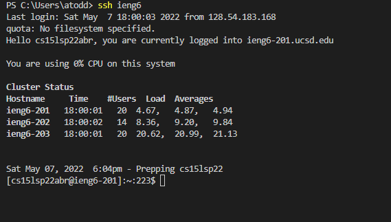
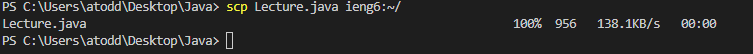
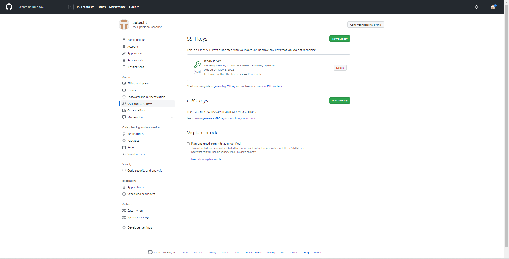
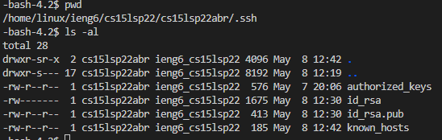
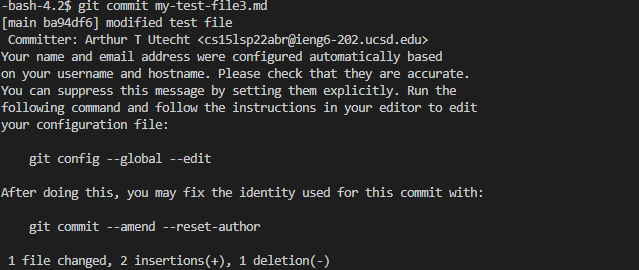
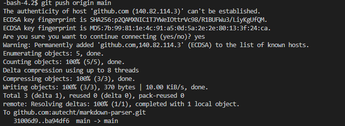
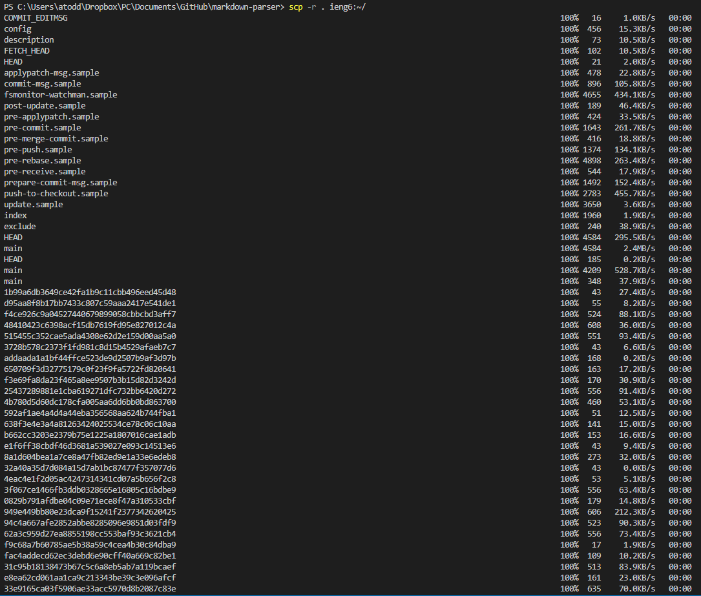
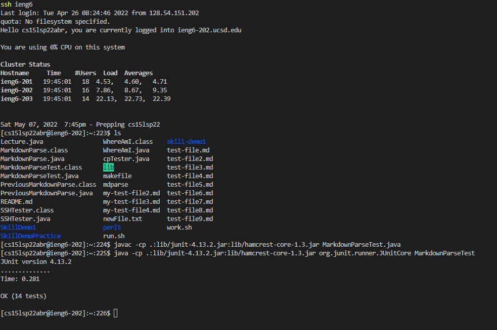
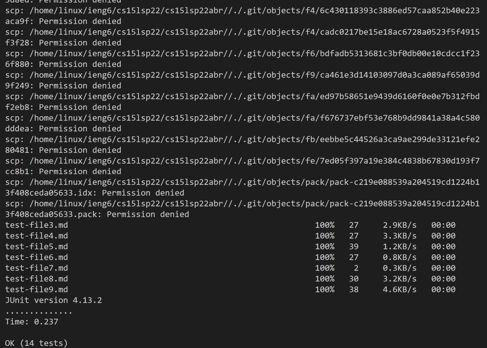

# Lab Report 3: Streamlining ssh, Pushing from a Server, and Copying Files Recursively
## Streamlining ```ssh``` Configuration
SSH allows you to include a ```config``` file so that you do not need to type the full username associated with the host every time you log in remotely. Below is my config file:


It associates the ```HostName```, ```ieng6.ucsd.edu```, and the ```User```, ```cs15lsp22abr```, with the chosen ```Host``` alias. With this, with ```ssh``` commands, I can type ```ieng6``` instead of ```cs15lsp22@ieng6.ucsd.edu```. Here is how it looks logging in:





And this is how it looks when used with ```scp```:



# Setup Github Access from ieng6
You can push changes from the ```ieng6``` server to github if you have a pair of public and private keys. To generate this pair of keys, use ```ssh-keygen```. Afterwards, use ```eval "$(ssh-agent -s)``` and ```ssh-add id-rsa``` so that the keys are added as ssh keys. You can then copy and paste the contents of the ```id_rsa.pub``` file after clicking on ```New SSH key``` on GitHub. This is where the public key is stored on GitHub:




This is where the private and public keys are stored on the server:



Here is what committing a change looks like (this doesn't need the keys):



And here is what pushing the change to the origin looks like:




[This](https://github.com/autecht/markdown-parser/commit/ba94df6405e0edaee30cd658e36798c2dbcd8d28) is the link to that commit!

# Copy whole directories with ```scp -r```

Using ```scp -r```, you can recursively copy everything in a directory rather than needing to copy many individual files. The directory after the ```-r``` is the directory it copies, so ```scp -r .``` will copy everything in the current directory to the specified location. Below, I used ```scp -r . ieng6:~/``` to copy my entire local repository to the home directory of my account on the ```ieng6.ucsd.edu``` server.



After doing this, I could log into the server remotely and run the tests in the repository!



Below, I combined commands to copy the repository to the server, log in to the server, run the tests, and log out.





