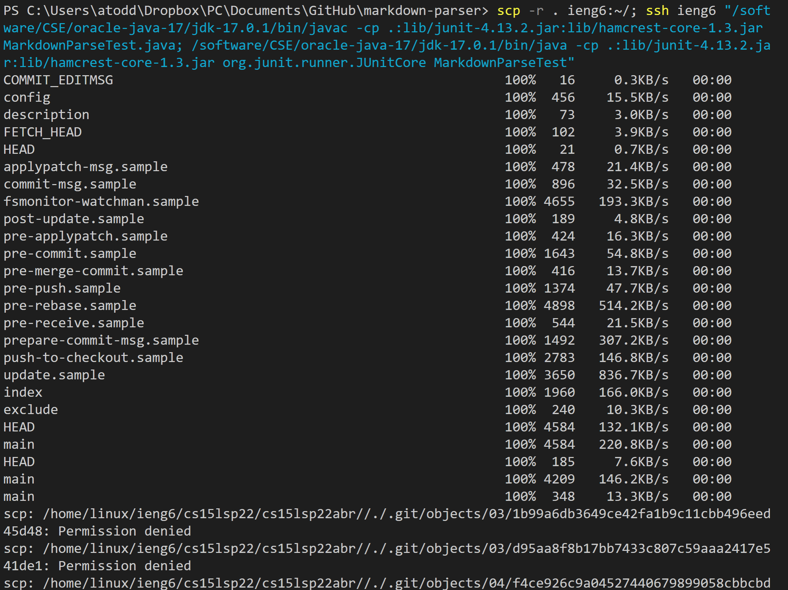

# Lab Report 3
## Streamlining ```ssh``` Configuration
SSH allows you to include a ```config``` file so that you do not need to type the full username associated with the host every time you log in remotely. Below is my config file:

It associates the ```HostName```, ```ieng6.ucsd.edu```, and the ```User```, ```cs15lsp22abr```, with the chosen ```Host``` alias. With this, with ```ssh``` commands, I can type ```ieng6``` instead of ```cs15lsp22@ieng6.ucsd.edu```. Here is how it looks logging in:

And this is how it looks when used with ```scp```:

# Setup Github Access from ieng6
# Copy whole directories with ```scp -r```

Using ```scp -r```, you can recursively copy everything in a directory rather than needing to copy many individual files. The directory after the ```-r``` is the directory it copies, so ```scp -r .``` will copy everything in the current directory to the specified location. Below, I used ```scp -r . ieng6:~/``` to copy my entire local repository to the home directory of my account on the ```ieng6.ucsd.edu``` server.


After doing this, I could log into the server remotely and run the tests in the repository!


Below, I combined commands to copy the repository to the server, log in to the server, run the tests, and log out.



