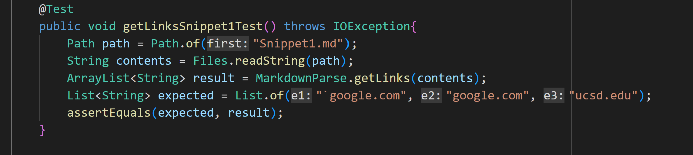
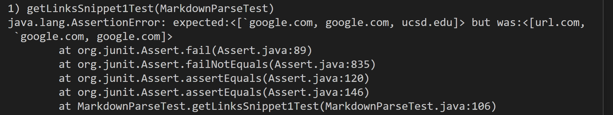
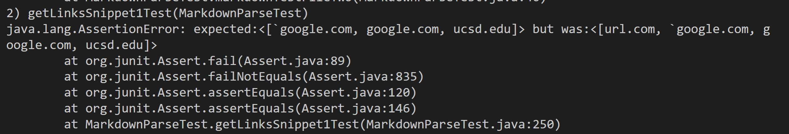
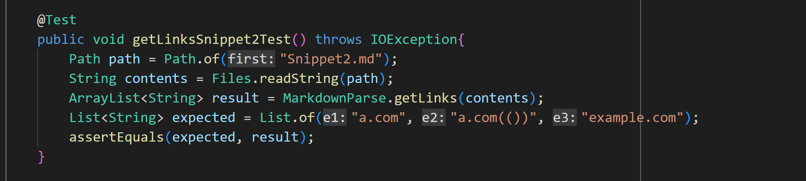
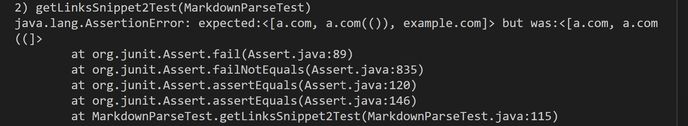
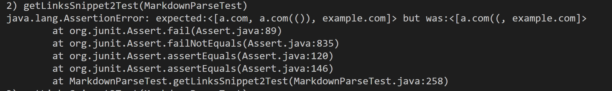
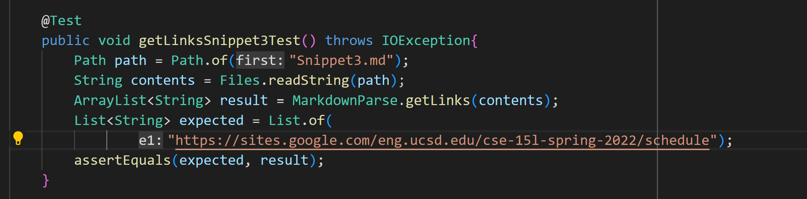
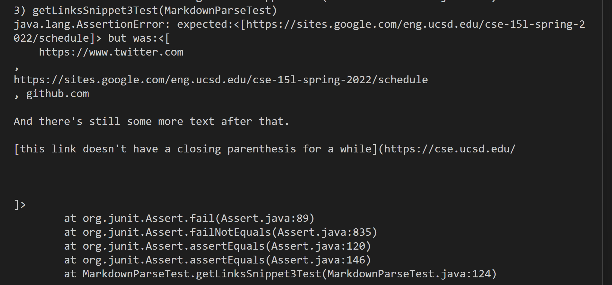
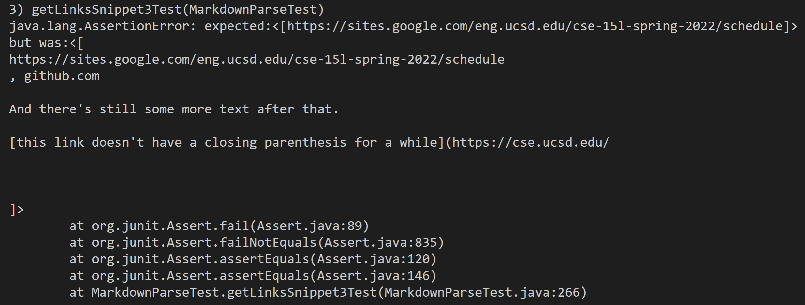

https://docs.google.com/document/d/1pRCPCxCt_zvS4dEZXCNvsFvaejKSj--nC9fMYW81by8/edit#

# Adding and Reviewing Tests
In this report, we are adding tests to markdown-parse implementations and discussing whether the implementations pass and how easily they could be improved.
## Links
[Here](https://github.com/autecht/markdown-parser) is the first markdown-parse repository, which is mine.

And [here](https://github.com/ddn005UCSD/markdown-parser) is the second one, which is the one our group reviewed in the week 7 lab.

## Making and Running the Tests
### Snippet 1
The first test looked like this:
```
`[a link`](url.com)

[another link](`google.com)`

[`cod[e`](google.com)

[`code]`](ucsd.edu)
```


Using Visual Stuio Code preview, the expected output is ```[`google.com, google.com, ucsd.edu]```. Here is how I created the test to verify the output: 



My implementation failed this test:



This implementation my group reviewed also failed this test: 



### Snippet 2
The second test looked like this:
```
[a [nested link](a.com)](b.com)

[a nested parenthesized url](a.com(()))

[some escaped \[ brackets \]](example.com)
```

The expected output for this snippet is ```[a.com, a.com(()), example.com]```. Here is how I created the test to verify the output:



My implementation failed this test:



This implementation my group reviewed also failed this test: 




### Snippet 3
The third test looked like this:
```
[this title text is really long and takes up more than 
one line

and has some line breaks](
    https://www.twitter.com
)

[this title text is really long and takes up more than 
one line](
https://sites.google.com/eng.ucsd.edu/cse-15l-spring-2022/schedule
)


[this link doesn't have a closing parenthesis](github.com

And there's still some more text after that.

[this link doesn't have a closing parenthesis for a while](https://cse.ucsd.edu/


)

And then there's more text
```


For this snippet, the expected output is ```[https://sites.google.com/eng.ucsd.edu/cse-15l-spring-2022/schedule]```. Here is how I created the test to verify the output:



My implementation failed this test:



This implementation my group reviewed also failed this test: 




## Thinking About Improvements
### Snippet 1
There is no small code change that would make my code work for Snippet 1 and all related cases using inline code with backticks. It would be too involved a change since you would need to keep track of backticks throughout the whole string input to determine areas that are inline code in order to exclude characters that are part of that code. 
### Snippet 2
There is no small code change that would make my code work for snippet 2 and all related cases that nest parentheses, brackets, and escaped brackets. The change would need to be more involved because it goes beyond simply checking for individual characters. Instead, you would need to make sure the open and close brackets and parentheses were balanced while also accounting for new open brackets being a valid start to a new nested link.

### Snippet 3
There is a small code change that will make my program work for Snippet 3 and all related cases that have newlines in brackets and parenthesis. The change would involve checking the result of the `indexOf()` method with the arguments of `\n\n` and first `openBracket`. If the value were between `openParen` and `closeParen`, the `while loop` would increment `currentIndex` and `continue`.

    

