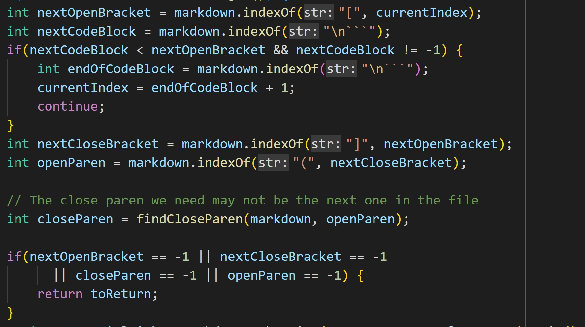
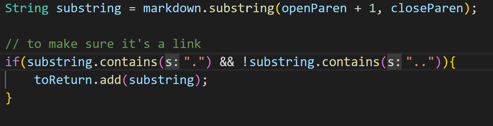

# Finding and Analyzing Different Outputs

## Finding Different Outputs

To find the tests with different results, I used a `.sh` file with a loop running through each file. For each test file, the loop printed the name of the file and the output of `MarkdownParse.java` run with the file, saving both to a text file. After running the `.sh` file in both implementations, I used `vimdiff` to see the differences.

This is the `.sh` file:

And this is some of the output from `vimdiff`:

The two implementations had different outputs for [342.md](https://autecht.github.io/cse15l-lab-reports/342.html) and [503.md](https://autecht.github.io/cse15l-lab-reports/503.html).

## 342.md

The expected output for `342.md` is `[]`. 

My implementation had the following output:

And the Lab 9 implementation had the following output:

As such, my implementation is correct.

Here is the beginning of the `getLinks()` method in the Lab 9 implementation:

The bug in the code of the Lab 9 implementation is that it never checks for the presence of backticks, so when backticks interfere with the format of the link, the method does not detect it. After the last if statement shown in the screenshot, there should be if statements to check that there are no sets of backticks that span across the characters that indicate a link.

## 503.md

The expected output for `342.md` is `["title"]`. 

My implementation had the following output:

And the Lab 9 implementation had the following output:

As such, the Lab 9 implementation is correct.

This is the part of the `getLinks()` method in my implementation that causes the bug: 

The bug is that the method assumes that valid links will have a `"."`, so it only adds the link to the list if it contains `"."`. The if statement shown in the image is causing this bug by because it only performs the necessary step of adding the link when the statement evaluates to `true`.

