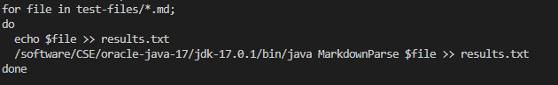
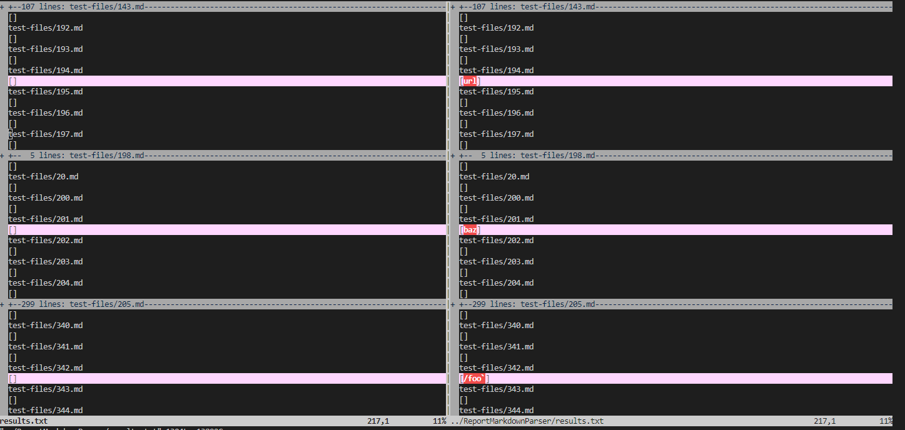
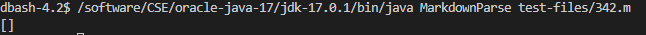
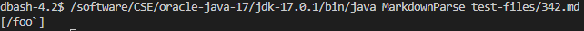
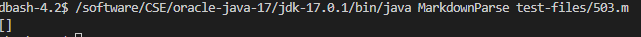
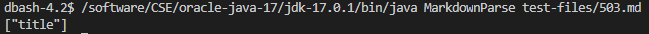

# Finding and Analyzing Different Outputs

## Finding Different Outputs

To find the tests with different results, I used a `.sh` file with a loop running through each file. For each test file, the loop printed the name of the file and the output of `MarkdownParse.java` run with the file, saving both to a text file. After running the `.sh` file in both implementations, I used `vimdiff` to see the differences.

This is the `.sh` file:

And this is some of the output from `vimdiff`:

The two implementations had different outputs for [342.md](https://autecht.github.io/cse15l-lab-reports/342.html) and [503.md](https://autecht.github.io/cse15l-lab-reports/503.html).

## 342.md

The expected output for `342.md` is `[]`. 

My implementation had the following output:

And the Lab 9 implementation had the following output:

As such, my implementation is correct.

## 503.md

The expected output for `342.md` is `["title"]`. 

My implementation had the following output:

And the Lab 9 implementation had the following output:

As such, the Lab 9 implementation is correct.

Describe which implementation is correct, or neither if both give the wrong output
Indicate both actual outputs (provide screenshots) and also what the expected output is (list the links that are expected in the output).
Decide on what it should produce (i.e., expected output) by using either VScode preview or the CommonMark demo site. 

For the implementation that’s not correct (or choose one if both are incorrect), describe the bug (the problem in the code) in about 2-3 sentences. You don’t have to provide a fix, but you should be specific about what is wrong with the program, and show the code that should be fixed (Provide a screenshot of code and highlight where the change needs to be made).
